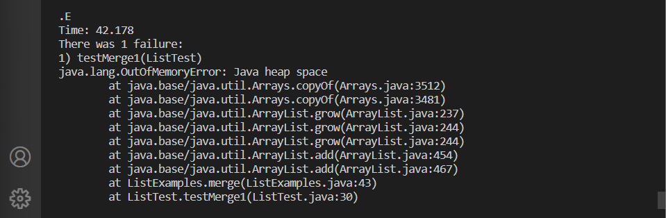

# Lab report 2

For the both the first and second image, the method handleRequest() is being callled. This method takes in a URI parameter called url. It then checks if the path of the url mathces the string "/add-message". If so, then the method will expect there to be a query. It will be split at the regix "=" and stored in an array where index 1 will store the message that will be added. Then it will append a new line. Therefore, if the method were to run again with the same pth and query, it will print the same thing below it.

## Part 2
I chose the bug in the merge method inside the ListExamples.java file.

The first one causes a failure while the second doesn't

public class ListTest {

    @Test
    public void testMerge1() {
        List<String> list1 = new ArrayList<String>();
        List<String> list2 = new ArrayList<String>();
        list1.add("Str");
        list2.add("xor");

        List<String> result = ListExamples.merge(list1, list2);

        assertArrayEquals(new String[] {"Str", "xor"}, result.toArray());
    }

  @Test
      public void testMerge2() {
          List<String> list1 = new ArrayList<String>();
          List<String> list2 = new ArrayList<String>();
          list1.add("xor");
          list2.add("Str");

          List<String> result = ListExamples.merge(list1, list2);

          assertArrayEquals(new String[] {"Str", "xor"}, result.toArray());
      }
  }
  
  The symptom is that an infinite while loop happens when performing merge in the first test.

  
  
The bug is in line 44. index1 should be changed to index2
 
    

