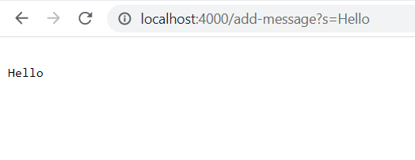
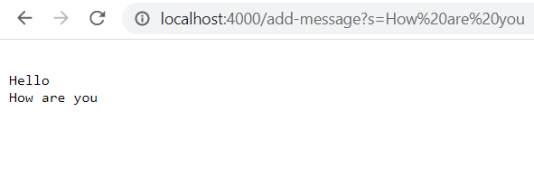
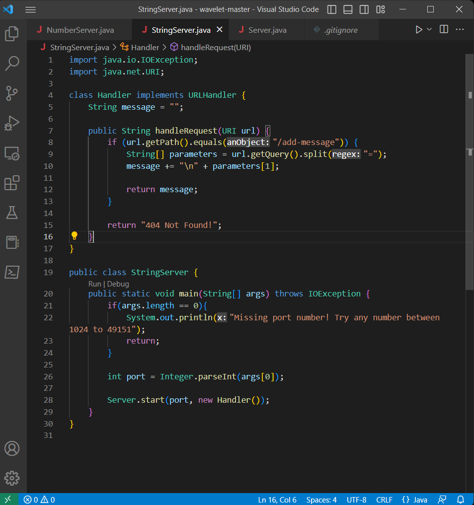

# Lab report 2

For the both the first and second image, the method handleRequest() is being callled. This method takes in a URI parameter called url. It then checks if the path of the url mathces the string "/add-message". If so, then the method will expect there to be a query. It will be split at the regix "=" and stored in an array where index 1 will store the message that will be added. Then it will append a new line. Therefore, if the method were to run again with the same pth and query, it will print the same thing below it.

